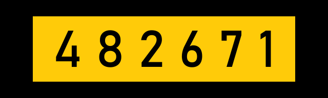
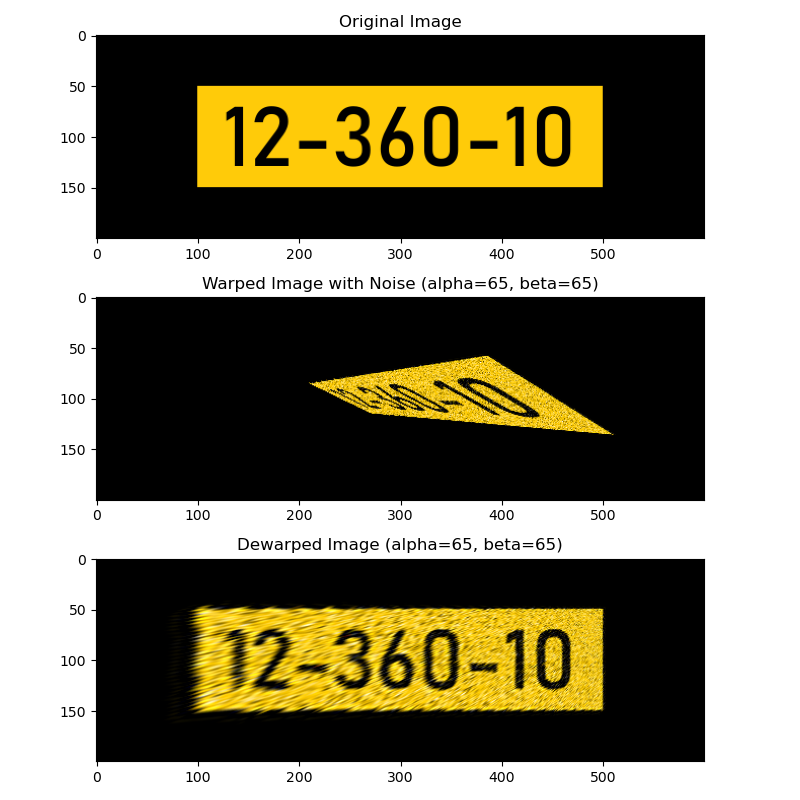

# License Plate Recognition Enhancement Project

**Full Project Title:** Generative image models for enhancing license plate images captured at extreme viewing angles

## Project Overview

This project aims to develop and compare generative AI models for enhancing license plate images captured at extreme viewing angles. The goal is to improve the clarity and readability of distorted and noisy license plate images using advanced deep-learning techniques.

## Current Implementation

At present, the project focuses on data preparation and simulation, including:

1. Synthetic License Plate Generation
2. Perspective Transformation (Warping)
3. Noise Injection
4. Perspective Correction (Dewarping)

These components form the foundation for creating a robust dataset that simulates real-world challenging scenarios for license plate recognition.

## Features

### Synthetic Data Generation
- Creates realistic license plate images with customizable parameters
- Supports various formats and styles of license plates

### Perspective Transformation (Warping)
- Simulates extreme viewing angles
- Applies projective geometry to distort license plate images

### Noise Injection
- Adds various types of noise to images (e.g., Gaussian, Salt-and-Pepper)
- Simulates real-world image degradation

### Perspective Correction (Dewarping)
- Attempts to reverse the warping process
- Provides a baseline for comparison with future AI-enhanced methods

## Results Visualization

## Planned Future Developments

- Implementation of U-Net for image enhancement
- Integration of Generative Adversarial Networks (GANs)
- Exploration of Differential Diffusion Models (DDMs)
- Comprehensive comparison of different AI models for license plate enhancement

## Contributors

- Orpaz Ben Aharon
- Igor Adamenko

## Mentor

Dr. Sasha Apartsin
