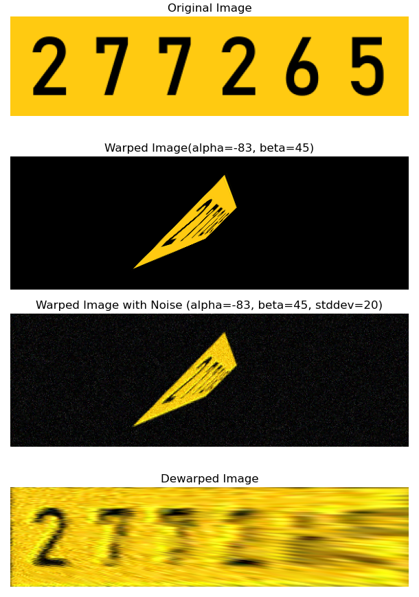
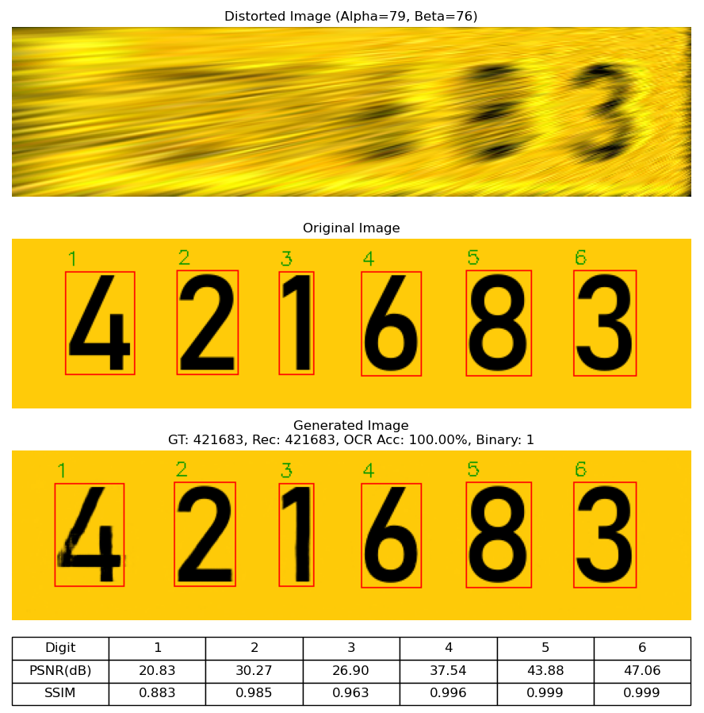

This is good final version:

# Generative Image Models for Enhancing License Plate Images

## Overview

This project investigates generative models to improve the readability of license plate images captured under extreme viewing angles and noise conditions. The research evaluates and compares **U-Net**, **GANs**, and **Diffusion Models** for restoring distorted license plates. The main objectives are to simulate distortions, implement advanced generative models, and evaluate them for improving readability and OCR accuracy.

---

## Methodology

### Data Preparation

Synthetic datasets were generated to simulate extreme viewing angles and noise conditions:

- **Perspective Distortion**: Applied 3D rotations and projections.
- **Noise Simulation**: Added Gaussian blur, luminance, chromatic disturbances, and mosaic artifacts.
- **Realignment and Cropping**: Restored distorted images to their original dimensions.
- **Dataset Partitioning**: Organized into training, validation, and test subsets with comprehensive angle coverage.

### Models

- **U-Net**: Encoder-decoder architecture with skip connections for efficient feature extraction and reconstruction.
- **Pix2Pix GAN**: Conditional GAN with a U-Net generator and PatchGAN discriminator for generating realistic and accurate corrections.
- **Diffusion Model (DDPM/DDRM)**: An iterative noise reduction framework extended for precise image restoration tasks.

### Evaluation Metrics

- **Peak Signal-to-Noise Ratio (PSNR)**: Measures noise reduction.
- **Structural Similarity Index (SSIM)**: Quantifies structural preservation.
- **OCR Accuracy**: Validates readability of restored license plates.

### Heatmap Visualization

Heatmaps visually represent model performance across the full range of angles in the test set. Metrics such as **PSNR**, **SSIM**, and **OCR Accuracy** are plotted to highlight trends and identify areas where models excel or struggle.

---

## Results

### License plate creation and augmentation
 

### U-Net Restoration Example
 

### Visualization Tool

The interactive visualization tool allows users to explore metrics like PSNR, SSIM, and OCR Accuracy by selecting angle combinations directly on the heatmaps.

---

## Future Work

### Model Optimization
- Fine-tune GAN and Diffusion Models for improved robustness.
- Experiment with new loss functions and expand the hyperparameter search space.

### Dataset Enhancements
- Incorporate more realistic noise patterns.
- Explore adaptive angle selection strategies for balanced dataset coverage.

### Model Expansion
- Investigate alternative architectures and enhancements for GANs and Diffusion Models.

### OCR System Improvements
- Explore advanced OCR tools for improved recognition accuracy.

### Visualization and Comparison
- Perform detailed model comparisons and generate comprehensive heatmaps.

---

## Contributors

- **Igor Adamenko**
- **Orpaz Ben Aharon**
- **Mentor**: Dr. Sasha Apartsin

---

## Technical Resources

| **Category**       | **Tools and Resources**                                  |
|---------------------|---------------------------------------------------------|
| **Hardware**        | NVIDIA GTX 1080 GPU, Google Colab                       |
| **Development Environments** | VS Code, Jupyter Notebooks, Anaconda          |
| **Frameworks**      | PyTorch                                                |
| **Libraries**       | OpenCV, NumPy, PIL (Pillow)                             |
| **OCR Tools**       | Tesseract OCR                                          |
| **Experiment Management** | MLflow (experiment tracking), Optuna (hyperparameter tuning) |
| **Visualization**   | Matplotlib (graphs, heatmaps, performance analyses)     |
| **Documentation**   | Google Docs, Microsoft Word                            |
| **Project Management** | Microsoft Project, Git (version control), GitHub   |